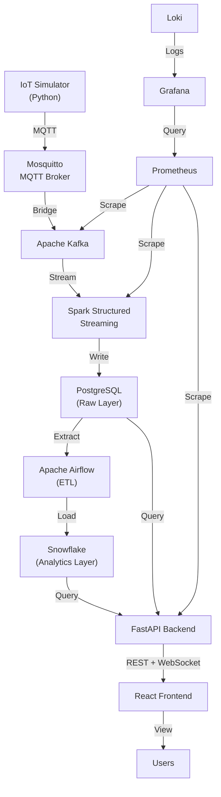

# Smart Factory IoT Analytics & Monitoring Platform 🏭📈

[](https://www.python.org/)
[](https://reactjs.org/)
[](https://fastapi.tiangolo.com/)
[](https://www.docker.com/)
[](https://opensource.org/licenses/MIT)

A complete, production-grade end-to-end IoT platform simulating a smart factory environment. This system generates realistic sensor data from industrial devices, streams it through a modern data pipeline, stores and transforms it across PostgreSQL and Snowflake layers, exposes it via a FastAPI backend, and visualizes it through a stunning React dashboard.

## 🌟 Features

- **✅ Realistic IoT Simulation**: Python-based simulator generating temperature, humidity, pressure, vibration, voltage, and current data for 5 different industrial device types.
- **✅ Real-time Data Streaming**: Data flows through an MQTT broker into Apache Kafka, processed in real-time by Spark Structured Streaming.
- **✅ Enterprise Data Warehousing**: Raw data stored in PostgreSQL, with an Airflow ETL pipeline loading transformed analytics data into Snowflake (SCD Type 2 support).
- **✅ Robust Backend API**: FastAPI application with JWT authentication, Role-Based Access Control (RBAC), and WebSocket support for live updates.
- **✅ Stunning React Dashboard**: Premium Dark Theme UI built with Vite, React 18, Material UI v5, and Recharts, featuring real-time charts and device monitoring.
- **✅ Full Observability**: Complete monitoring stack with Prometheus metrics, pre-built Grafana dashboards, and Loki for centralized logging.
- **✅ Containerized & Kubernetes Ready**: Fully containerized with Docker Compose for local development and complete Kubernetes manifests for production deployment.
- **✅ CI/CD Workflows**: GitHub Actions pipelines for automated linting, testing, Docker image building, and security scanning.

## 🏗️ Architecture



## 🛠️ Technology Stack

| Category | Technologies |
|----------|--------------|
| **Data Ingestion** | Python, Eclipse Mosquitto (MQTT), Apache Kafka |
| **Stream Processing** | Apache Spark (Structured Streaming) |
| **Databases** | PostgreSQL, Snowflake |
| **ETL & Orchestration** | Apache Airflow |
| **Backend API** | FastAPI, SQLAlchemy, Pydantic, WebSockets |
| **Frontend** | React 18, TypeScript, Material UI v5, Recharts, Zustand |
| **DevOps & Infrastructure**| Docker, Kubernetes, Nginx |
| **Monitoring & Logging** | Prometheus, Grafana, Loki |
| **CI/CD** | GitHub Actions |

## 🚀 Quick Start (Local Development)

### Prerequisites
- Docker and Docker Compose (Minimum 16GB RAM recommended for full stack)
- Python 3.11+
- Node.js 20+

### Setup

1. **Clone the repository**
   ```bash
   git clone https://github.com/yourusername/smart-factory-iot.git
   cd smart-factory-iot
   ```

2. **Configure Environment Variables**
   ```bash
   cp .env.example .env
   # Edit .env and add your Snowflake credentials (optional for local dev)
   ```

3. **Start the "Lite" Stack (Recommended for Development)**
   Starts Postgres, MQTT, Kafka, Backend, and Frontend (skips Spark, Airflow, and Monitoring).
   ```bash
   docker-compose -f docker-compose.lite.yml up -d
   ```

4. **Access the Services**
   - **Frontend Dashboard**: http://localhost:3000
   - **Backend API Docs**: http://localhost:8000/docs
   - **PgAdmin** (if enabled): http://localhost:5050

### Starting the Full Stack
To run the complete data pipeline including Spark, Airflow, and the monitoring stack:
```bash
docker-compose up -d
```
*Note: This requires significant system resources.*

## 📁 Project Structure
Please see `ARCHITECTURE.md` for a detailed breakdown of the components.

## 📖 Documentation
- [Architecture Details](ARCHITECTURE.md)
- [Deployment Guide](DEPLOYMENT_GUIDE.md)
- [Interview & Presentation Guide](INTERVIEW_GUIDE.md)

## 🤝 Contributing
Contributions, issues, and feature requests are welcome!

## 📄 License
This project is [MIT](https://opensource.org/licenses/MIT) licensed.
