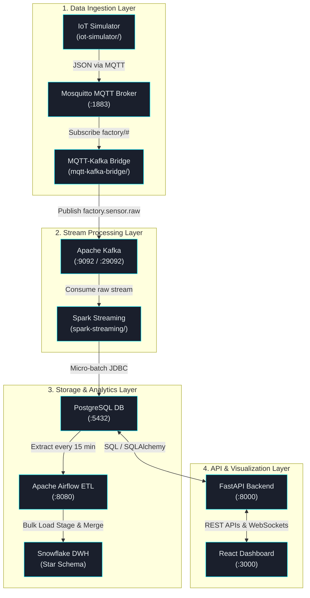

# Smart Factory IoT Analytics & Monitoring Platform: Verification & Testing Guide

This document is a comprehensive validation, verification, and testing manual for the Smart Factory IoT Analytics & Monitoring Platform. It provides layer-by-layer instructions, sample payloads, SQL scripts, troubleshooting tips, and an end-to-end integration checklist.



---

## Part 1: Layer-by-Layer Verification Guide

---

### 1. IoT Simulator (`iot-simulator`)

#### A. Purpose of the Component
Simulates physical factory hardware (OPC Controllers, Conveyor Belts, Pumps, Motors, and Steam Boilers). It generates realistic, noisy time-series sensor telemetry and periodically injects anomalous data patterns to test real-time alert trigger logic.

#### B. How Data Enters
None. The simulator is the data origin. It uses configuration files (`config.py`) to instantiate virtual machines and runs a main event loop that ticks every `PUBLISH_INTERVAL` seconds (default: 2s).

#### C. How Data Leaves
Data is serialized as a JSON string and published using the `paho-mqtt` library to the local Eclipse Mosquitto broker on topic strings matching `factory/{location}/{device_type}/{device_id}`.

#### D. Commands to Verify Operating Status
If running outside Docker:
```powershell
# Navigate to simulator directory, build venv, install packages, and execute
cd .\iot-simulator
python -m venv venv
.\venv\Scripts\Activate.ps1
pip install -r requirements.txt
python simulator.py
```
If running within Docker:
```bash
# Check container status
docker ps | findstr sf-iot-simulator

# Follow live output logs
docker logs -f sf-iot-simulator
```

#### E. SQL Queries to Validate Data
N/A (Pre-database layer).

#### F. Expected Output / Logs Example
```log
2026-06-03 01:10:00,123 - INFO - Initialized device: DEV-OPC-001 (OPC)
2026-06-03 01:10:00,125 - INFO - Initialized device: DEV-CONV-001 (Conveyor)
2026-06-03 01:10:00,128 - INFO - Initialized device: DEV-PUMP-001 (Pump)
2026-06-03 01:10:00,130 - INFO - Initialized device: DEV-MOTOR-001 (Motor)
2026-06-03 01:10:00,132 - INFO - Initialized device: DEV-BOILER-001 (Boiler)
2026-06-03 01:10:00,135 - INFO - --- Smart Factory Simulator Started ---
2026-06-03 01:10:30,136 - INFO - Stats: Published 75 messages. Rate: 2.50 msg/sec.
```

#### G. Common Errors
*   `ConnectionRefusedError: [Errno 111] Connection refused`: The simulator cannot connect to the MQTT broker.
*   `ModuleNotFoundError: No module named 'paho'`: Python packages were not installed in the current environment.

#### H. Troubleshooting Steps
1. Verify the Mosquitto container is running (`docker ps | findstr sf-mqtt`).
2. Verify host bindings. If running the script directly on your host machine, change `MQTT_HOST` in `.env` to `localhost`. If running inside Docker Compose, it should resolve via Docker DNS to `mqtt`.
3. Check the host port configuration using `netstat -ano | findstr 1883` to ensure no other Mosquitto instance is running locally on the same port.

#### I. Health Check Commands
Check Docker container status and resource usage:
```bash
docker inspect --format='{{.State.Status}}' sf-iot-simulator
docker stats sf-iot-simulator --no-stream
```

#### J. Interview Explanation
> "In a real industrial environment, we can't test a data pipeline by directly attaching to multimillion-dollar PLCs or boiler safety valves and forcing them into critical alert ranges. We built an object-oriented Python simulator mimicking factory devices to inject noise and anomalies safely. It uses standard physical telemetry schemas and publishes to MQTT, mirroring how Kepware or an OPC-UA gateway behaves in a real plant."

---

### 2. MQTT Broker (Mosquitto)

#### A. Purpose of the Component
Acts as the edge ingestion gateway. It handles thousands of lightweight publish-subscribe connections from local factory field devices, routing sensor readings to subscribers without blocking.

#### B. How Data Enters
Enters via TCP Port `1883` from the Simulator container.

#### C. How Data Leaves
Dispatched to subscribers subscribing to wildcard topics (e.g., `factory/#`). The primary subscriber is the `mqtt-kafka-bridge` client.

#### D. Commands to Verify Operating Status
Use `mosquitto_sub` (bundled inside the container) to monitor topic transmissions:
```bash
# Subscribe to all factory telemetry topics in real-time
docker exec -it sf-mqtt mosquitto_sub -h localhost -p 1883 -t "factory/#" -v
```

#### E. SQL Queries to Validate Data
N/A (Pre-database broker).

#### F. Expected Output / Logs Example
```
factory/Assembly_Line_A/OPC/DEV-OPC-001 {"device_id": "DEV-OPC-001", "device_type": "OPC", "timestamp": "2026-06-03T01:12:00.123Z", "location": "Assembly Line A", "status": "online", "temperature": 23.45, "humidity": 45.2, "pressure": 1.013, "vibration": 0.05, "voltage": 220.1, "current": 1.2}
factory/Boiler_Room_E/Boiler/DEV-BOILER-001 {"device_id": "DEV-BOILER-001", "device_type": "Boiler", "timestamp": "2026-06-03T01:12:01.456Z", "location": "Boiler Room E", "status": "online", "temperature": 185.2, "vibration": 0.54, "pressure": 7.3, "voltage": 230.4, "current": 8.9, "humidity": 50.1}
```

#### G. Common Errors
*   `Socket error on client <unknown>, disconnecting`: Indicates a client initiated a handshake but crashed, or sent malformed packets.
*   `Address already in use`: A local service on the host is already bound to port 1883.

#### H. Troubleshooting Steps
1. Stop any local Mosquitto service running directly on the host OS:
   - **Windows**: Run `services.msc`, locate `Mosquitto Broker`, and click Stop. Or in PowerShell: `Stop-Service -Name mosquitto` (if installed).
2. Check Mosquitto Docker logs to verify access permissions:
   `docker logs sf-mqtt`
   Ensure the Mosquitto configuration file (`/mosquitto/config/mosquitto.conf`) has `allow_anonymous true` and `listener 1883 0.0.0.0` configured for local testing.

#### I. Health Check Commands
Verify broker uptime via the internal `$SYS` topic:
```bash
docker exec -it sf-mqtt mosquitto_sub -h localhost -p 1883 -t "$SYS/broker/uptime" -C 1 -W 3
```

#### J. Interview Explanation
> "MQTT is the industry standard for IoT ingestion because it is incredibly lightweight. Since devices might communicate over cellular links or low-bandwidth networks, HTTP overhead is too high. Mosquitto handles high-frequency pub-sub messages at the edge. However, Mosquitto lacks long-term storage, partition scalability, and stream-processing capabilities. That is why we bridge it to Kafka as soon as it arrives."

---

### 3. Apache Kafka & ZooKeeper

#### A. Purpose of the Component
Kafka serves as our central streaming buffer (commit log). It decouples edge ingestion (MQTT Broker) from real-time analytics (Spark Streaming). If Spark goes down for maintenance, Kafka buffers incoming telemetry on disk for up to 7 days, avoiding data loss. ZooKeeper coordinates cluster state and leader elections.

#### B. How Data Enters
Written by the `mqtt-kafka-bridge` container using a `KafkaProducer`, writing to the topic `factory.sensor.raw` on internal port `29092` (container network) or port `9092` (external host).

#### C. How Data Leaves
Consumed by Spark Structured Streaming via a Kafka consumer group mapping to `factory.sensor.raw`.

#### D. Commands to Verify Operating Status
Verify topics exist in the Kafka cluster:
```powershell
# List existing Kafka topics
docker exec -it sf-kafka kafka-topics --bootstrap-server localhost:29092 --list
```
Consume live records directly from the raw telemetry topic:
```powershell
# Read last 5 messages from the start of the topic
docker exec -it sf-kafka kafka-console-consumer --bootstrap-server localhost:29092 --topic factory.sensor.raw --from-beginning --max-messages 5
```

#### E. SQL Queries to Validate Data
N/A (Stream queuing layer).

#### F. Expected Output / Logs Example
Topic List:
```
__consumer_offsets
factory.sensor.raw
```
Consumer Output:
```json
{"device_id": "DEV-PUMP-001", "device_type": "Pump", "timestamp": "2026-06-03T01:14:02.100Z", "location": "Cooling System C", "status": "online", "temperature": 45.67, "humidity": 60.2, "pressure": 2.45, "vibration": 1.25, "voltage": 222.1, "current": 4.5}
```

#### G. Common Errors
*   `org.apache.kafka.common.errors.TimeoutException: Failed to update metadata after 60000 ms`: The Kafka brokers cannot resolve each other's addresses or are unreachable from the client.
*   `ReplicaNotAvailableException`: Kafka cannot replicate the topic partition because not enough brokers are online.

#### H. Troubleshooting Steps
1. Verify Kafka container environment variable `KAFKA_ADVERTISED_LISTENERS`. The listener `PLAINTEXT://kafka:29092` is used for docker-to-docker traffic, while `PLAINTEXT_HOST://localhost:9092` is used for code running outside docker.
2. Ensure ZooKeeper is completely healthy (`docker logs sf-zookeeper`) before starting Kafka.
3. If running low on disk space, Kafka will disable writes (read-only mode). Free space or clean volume allocations: `docker volume prune`.

#### I. Health Check Commands
Verify Zookeeper is responding to the four-letter word `ruok` (Are You OK):
```powershell
echo ruok | nc localhost 2181
# Expected response: imok
```
Verify Kafka topic replication status:
```powershell
docker exec -it sf-kafka kafka-topics --bootstrap-server localhost:29092 --describe --topic factory.sensor.raw
```

#### J. Interview Explanation
> "We used Kafka as the backbone of our pipeline because IoT streams are bursty. Under sudden surges or device failures, database inserts can lock or slow down. Kafka acts as an intermediate log, storing telemetry sequentially on disk. By partitioning the `factory.sensor.raw` topic, we can scale consumers (like Spark executors) horizontally. ZooKeeper maintains broker metadata, manages ACLs, and coordinates partitions."

---

### 4. Spark Structured Streaming (`spark-streaming`)

#### A. Purpose of the Component
The stream processing engine. It reads raw byte payloads from Kafka, deserializes JSON according to a strict schema, applies windowed rule evaluations (e.g. flagging temperature spikes or vibration spikes), and streams the outputs into PostgreSQL using micro-batches.

#### B. How Data Enters
Consumes live streams from Kafka topic `factory.sensor.raw` on `kafka:29092`.

#### C. How Data Leaves
Writes micro-batches using a JDBC connection (`jdbc:postgresql://postgres:5432/smart_factory`) to the `sensor_data` and `alerts` tables.

#### D. Commands to Verify Operating Status
Inspect PySpark startup sequence and trace micro-batch runs:
```powershell
# Follow Spark console output logs
docker logs -f sf-spark-streaming
```

#### E. SQL Queries to Validate Data
Validate that Spark has generated check-pointing files by inspecting its state directory:
```powershell
docker exec -it sf-spark-streaming ls /tmp/spark-checkpoints/raw
```

#### F. Expected Output / Logs Example
```log
2026-06-03 01:15:10 - INFO - Spark Session Initialized.
[WARN] Main: SparkContext setLogLevel("WARN") active.
-------------------------------------------
Batch: 12
-------------------------------------------
+-------------+-------------------+-----------+---------+--------+
|    device_id|          timestamp|temperature|pressure|vibration|
+-------------+-------------------+-----------+---------+--------+
|  DEV-OPC-001|2026-06-03 01:15:00|       23.4|     1.01|    0.05|
|DEV-BOILER-001|2026-06-03 01:15:02|      185.2|      7.3|    0.54|
+-------------+-------------------+-----------+---------+--------+
```

#### G. Common Errors
*   `java.lang.ClassNotFoundException: org.postgresql.Driver`: The Postgres JDBC driver is missing from the classpath.
*   `Failed to create checkpoint directory`: Permissions issue or host volume path conflict mapping `/tmp/spark-checkpoints`.

#### H. Troubleshooting Steps
1. Verify the JDBC driver jar (`postgresql-42.6.0.jar`) is being downloaded inside the Dockerfile.
2. If schema changes occur, Spark will fail due to schema mismatch. Reset the checkpoints folder to clear out stale schemas:
   `docker-compose down -v` (removes the `spark_checkpoints` volume).
3. Verify that Spark can connect to PostgreSQL using pg_isready from the Spark container:
   `docker exec -it sf-spark-streaming nc -zv postgres 5432`

#### I. Health Check Commands
Check the status of Spark's background stream processes in Python or query its logs for `Query raw has failed` or `Exception` stack traces.

#### J. Interview Explanation
> "We chose Spark Structured Streaming over raw cron jobs because industrial anomaly detection requires sub-second responsiveness. Structured Streaming treats live streams as an unbound table, allowing us to use standard declarative SQL operations. We enforce schema validation at the door—any malformed JSON payload is rejected before it can pollute Postgres. Using `foreachBatch` allows us to bulk insert records to PostgreSQL using parallel JDBC connections."

---

### 5. PostgreSQL

#### A. Purpose of the Component
Operational Data Store (ODS). Serves as the database (OLTP) for the web backend, storing device master metadata, short-term raw telemetry records, active anomalies (alerts), health state, and users.

#### B. How Data Enters
1. Spark Streaming inserts sensor records to `sensor_data` and trigger records to `alerts`.
2. Seeding scripts (`database/init/04_seed_devices.sql`) insert initial devices.
3. Airflow inserts metadata logs into the `etl_audit` table.

#### C. How Data Leaves
1. FastAPI queries tables to serve dashboard charts and WebSockets.
2. Airflow extracts historical records for bulk loading into Snowflake.

#### D. Commands to Verify Operating Status
Verify database connectivity:
```powershell
docker exec -it sf-postgres pg_isready -U factory_admin -d smart_factory
```
Open interactive PSQL session:
```powershell
docker exec -it sf-postgres psql -U factory_admin -d smart_factory
```

#### E. SQL Queries to Validate Data
```sql
-- 1. Ensure sensor data is entering and count is increasing
SELECT COUNT(*) FROM sensor_data;

-- 2. Verify most recent records contain logical values
SELECT device_id, timestamp, temperature, pressure, vibration 
FROM sensor_data 
ORDER BY timestamp DESC 
LIMIT 5;

-- 3. Confirm alert engine triggers and is joined to devices
SELECT a.id, d.device_name, a.alert_type, a.severity, a.actual_value, a.created_at
FROM alerts a
JOIN device_master d ON a.device_id = d.device_id
ORDER BY a.created_at DESC 
LIMIT 5;

-- 4. Verify trigger-based device health scores are updated
SELECT device_id, uptime_percentage, anomaly_count, health_score, last_seen 
FROM device_health;
```

#### F. Expected Output / Logs Example
```
smart_factory=# SELECT COUNT(*) FROM sensor_data;
 count 
-------
   412
(1 row)

smart_factory=# SELECT device_id, health_score FROM device_health;
   device_id    | health_score 
----------------+--------------
 DEV-OPC-001    |       100.00
 DEV-CONV-001   |        98.00
 DEV-PUMP-001   |        95.00
 DEV-MOTOR-001  |        97.00
 DEV-BOILER-001 |        85.00
(5 rows)
```

#### G. Common Errors
*   `FATAL: password authentication failed for user "factory_admin"`: Credentials inside `.env` mismatch the initialization settings.
*   `Relation "sensor_data" does not exist`: Tables were not seeded or initialization script failed.

#### H. Troubleshooting Steps
1. Verify Postgres Docker volumes. If you change password environment variables after database creation, Postgres won't update them on restart. Clear the volume to re-initialize: `docker-compose down -v`.
2. Inspect the Docker entrypoint logs to see if schema DDL files in `/docker-entrypoint-initdb.d/` executed successfully:
   `docker logs sf-postgres | findstr -i "executing"`

#### I. Health Check Commands
```powershell
docker exec -it sf-postgres pg_isready -U factory_admin -d smart_factory
```

#### J. Interview Explanation
> "PostgreSQL functions as our transactional (OLTP) core. Because index lookups and micro-second single-row inserts must occur continuously, we require a highly responsive relational database. We utilize partitioning on `sensor_data` by month to maintain fast query response times. To keep analytics decoupled from the main thread, we implemented a PL/pgSQL trigger that automatically recalculates device health metrics whenever Spark Streaming inserts a new critical alert."

---

### 6. Apache Airflow (`airflow`)

#### A. Purpose of the Component
Workflow Orchestrator. Coordinates batch ingestion, extracting telemetry from PostgreSQL, uploading it to Snowflake staging tables, merging incremental states into dimensions/facts, running data quality tests, and auditing SLA compliance.

#### B. How Data Enters
Triggers automatically on cron schedules or manual CLI interventions. Pulls data from Postgres via `PostgresHook`.

#### C. How Data Leaves
Pushes CSV datasets to local files or Cloud storage (S3/GCS) and executes remote SQL merge commands on Snowflake.

#### D. Commands to Verify Operating Status
Verify DAG files are parsed successfully and listed in the scheduler:
```powershell
docker exec -it sf-airflow-scheduler airflow dags list
```
Trigger the ETL workflow manually:
```powershell
docker exec -it sf-airflow-scheduler airflow dags trigger sensor_data_etl
```
Verify custom Operators and plugins load:
```powershell
docker exec -it sf-airflow-scheduler airflow plugins
```

#### E. SQL Queries to Validate Data
Validate ETL logs written to Postgres:
```sql
SELECT dag_id, task_id, start_time, end_time, status 
FROM etl_audit 
WHERE job_name = 'sensor_data_etl' 
ORDER BY start_time DESC;
```

Execution log extract (with Snowflake Connection active):
```log
[2026-06-03 01:20:15,102] {postgres_extract.py:31} INFO - Extracted 120 rows from PostgreSQL.
[2026-06-03 01:20:15,445] {snowflake_load.py:65} INFO - Successfully loaded 120 rows into Snowflake.
[2026-06-03 01:20:15,550] {sensor_etl_dag.py:90} INFO - Executing Snowflake transformation queries...
[2026-06-03 01:20:15,620] {sensor_etl_dag.py:93} INFO - Running Snowflake Query #1...
[2026-06-03 01:20:15,710] {sensor_etl_dag.py:93} INFO - Running Snowflake Query #2...
[2026-06-03 01:20:15,800] {sensor_etl_dag.py:93} INFO - Running Snowflake Query #3...
[2026-06-03 01:20:15,890] {sensor_etl_dag.py:93} INFO - Running Snowflake Query #4...
[2026-06-03 01:20:15,950] {sensor_etl_dag.py:95} INFO - Snowflake transformations executed successfully.
[2026-06-03 01:20:15,999] {taskinstance.py:1250} INFO - Marking task as SUCCESS.
```

Execution log extract (with Snowflake Connection disabled):
```log
[2026-06-03 01:20:15,102] {postgres_extract.py:31} INFO - Extracted 120 rows from PostgreSQL.
[2026-06-03 01:20:15,145] {snowflake_load.py:67} INFO - [MOCK MODE] Snowflake connection disabled. Simulated load of 120 rows.
[2026-06-03 01:20:15,190] {sensor_etl_dag.py:97} INFO - [MOCK MODE] Snowflake connection disabled. Simulated dimensions merge.
[2026-06-03 01:20:15,200] {taskinstance.py:1250} INFO - Marking task as SUCCESS.
```

#### G. Common Errors
*   `DAG import errors`: Python syntax errors inside DAG files or missing dependencies in the airflow container.
*   `Broken connection`: The connection profile (e.g. `postgres_default` or `snowflake_default`) was not defined in Airflow's metadata database.

#### H. Troubleshooting Steps
1. Access the web interface at `http://localhost:8080` (admin/admin). Go to **Admin -> Connections** and verify that `postgres_default` points to host `postgres`, port `5432`, database `smart_factory`, with the correct credentials.
2. If `snowflake_default` is missing and you want a real Snowflake pipeline, add the connection profile in the UI. If you want to run locally without Snowflake credentials, set `SNOWFLAKE_ENABLED=false` in `.env` to fallback to log warning simulation.

#### I. Health Check Commands
```powershell
docker exec -it sf-airflow-webserver curl -f http://localhost:8080/health
```

#### J. Interview Explanation
> "We selected Airflow because it allows us to define data pipelines as DAGs (Directed Acyclic Graphs) using Python. Our orchestration runs on a 15-minute schedule. Airflow handles failures gracefully: if a network hiccup interrupts the Snowflake load, Airflow automatically retries the task after 5 minutes, logs the stack trace, and updates the `etl_audit` table. This provides complete auditability of our ingestion history."

---

### 7. Snowflake Data Warehouse

#### A. Purpose of the Component
Enterprise Analytical Data Warehouse (OLAP). It stores historical operational data and models it using a Star Schema (Dimensions and Facts). It is designed to run complex analytical queries over millions of rows without impacting the live dashboard database.

#### B. How Data Enters
CSV data is bulk loaded using Snowflake's COPY command, orchestrated by Airflow's `SnowflakeLoadOperator`.

#### C. How Data Leaves
Serves Business Intelligence (BI) tools (e.g., Tableau, PowerBI), data science tools, and ad-hoc analytical queries.

#### D. Commands to Verify Operating Status
If `snowsql` is installed on your host:
```powershell
snowsql -a ITSWWZI-UJ44877 -u SHYAM123
```
Otherwise, run a verification script using the `snowflake-connector-python` package in a scratch directory:
```python
# C:\Users\ASUS\OneDrive\Desktop\Full stack project\smart-factory-iot\scratch\test_snowflake.py
import os
import snowflake.connector
from dotenv import load_dotenv
load_dotenv()

conn = snowflake.connector.connect(
    user=os.getenv("SNOWFLAKE_USER"),
    password=os.getenv("SNOWFLAKE_PASSWORD"),
    account=os.getenv("SNOWFLAKE_ACCOUNT"),
    warehouse=os.getenv("SNOWFLAKE_WAREHOUSE"),
    database=os.getenv("SNOWFLAKE_DATABASE"),
    schema=os.getenv("SNOWFLAKE_SCHEMA")
)
cursor = conn.cursor()
cursor.execute("SELECT CURRENT_VERSION()")
print("Snowflake Version:", cursor.fetchone()[0])
```

#### E. SQL Queries to Validate Data
Run these queries in the Snowflake worksheet console:
```sql
-- 1. Verify staging records loaded by Airflow
SELECT COUNT(*) FROM SMART_FACTORY_DWH.STAGING.SENSOR_DATA_STG;

-- 2. Verify SCD Type 2 dimension mapping
SELECT DEVICE_KEY, DEVICE_ID, LOCATION, STATUS, IS_CURRENT, EFFECTIVE_DATE, EXPIRY_DATE
FROM SMART_FACTORY_DWH.ANALYTICS.DIM_DEVICE
ORDER BY DEVICE_ID, EFFECTIVE_DATE;

-- 3. Verify Fact Table load and join dimension
SELECT F.SENSOR_DATA_KEY, D.DEVICE_NAME, F.READING_TIMESTAMP, F.TEMPERATURE, F.IS_ANOMALY
FROM SMART_FACTORY_DWH.ANALYTICS.FACT_SENSOR_DATA F
JOIN SMART_FACTORY_DWH.ANALYTICS.DIM_DEVICE D ON F.DEVICE_KEY = D.DEVICE_KEY
WHERE D.IS_CURRENT = TRUE
LIMIT 10;
```

#### F. Expected Output / Logs Example
```
+------------+----------------------+---------------------+-------------+------------+
| DEVICE_KEY | DEVICE_NAME          | READING_TIMESTAMP   | TEMPERATURE | IS_ANOMALY |
+------------+----------------------+---------------------+-------------+------------+
| 1          | Steam Boiler Epsilon | 2026-06-03 01:10:00 | 185.230     | FALSE      |
| 2          | Drive Motor Delta    | 2026-06-03 01:10:02 | 45.670      | FALSE      |
+------------+----------------------+---------------------+-------------+------------+
```

#### G. Common Errors
*   `000605 (57014): SQL execution error: Warehouse COMPUTE_WH suspended`: The warehouse is currently offline and auto-resume is not enabled.
*   `002003 (02000): SQL compilation error: Database 'SMART_FACTORY_DWH' does not exist`: Schema DDL scripts have not been executed on the account.

#### H. Troubleshooting Steps
1. Log into your Snowflake Web Console and verify that the database `SMART_FACTORY_DWH` and schemas `STAGING` and `ANALYTICS` have been created using the DDL scripts in `snowflake/ddl/`.
2. Check the user permissions. Ensure the role `SYSADMIN` (or the role assigned to `SNOWFLAKE_ROLE`) has operational privileges to read/write to the database and schemas.

#### I. Health Check Queries
```sql
SELECT SYSTEM$STATUS('COMPUTE_WH');
```

#### J. Interview Explanation
> "For analytics, we separate transactional (OLTP) and analytical (OLAP) workloads. Postgres handles fast inserts and live WebSocket reads, while Snowflake houses our historical Star Schema. We implemented Slowly Changing Dimensions (SCD) Type 2 on the `DIM_DEVICE` dimension. If a device moves from 'Assembly Line A' to 'Packaging Zone B', we expire the old record and insert a new active one. This ensures that historical aggregation reports remain accurate to the device's past location."

---

### 8. FastAPI Backend

#### A. Purpose of the Component
Exposes the application's RESTful API endpoints and coordinates WebSocket loops. It serves authenticated requests for live readings, handles historical chart aggregations, exposes Prometheus metrics, and manages JWT security rules.

#### B. How Data Enters
1. Read requests from the React Frontend.
2. Direct connection queries fetching states from PostgreSQL (`database.py`).

#### C. How Data Leaves
1. REST API endpoints returning JSON payloads.
2. WebSockets pushing telemetry points every 2 seconds to connected clients.

#### D. Commands to Verify Operating Status
Verify backend health via curl:
```powershell
curl http://localhost:8000/health
```
Verify interactive Swagger documentation endpoint:
Navigate in a browser to: `http://localhost:8000/docs`

Authenticate and retrieve a JWT token:
```powershell
curl -X POST "http://localhost:8000/api/v1/auth/login" `
  -H "Content-Type: application/x-www-form-urlencoded" `
  -d "username=admin&password=password123"
```

#### E. SQL Queries to Validate Data
Validate that the user list exists in Postgres:
```sql
SELECT id, username, role, is_active FROM users;
```

#### F. Expected Output / Logs Example
Health Check Output:
```json
{"status":"healthy","version":"1.0.0"}
```
JWT Authentication Output:
```json
{
  "access_token": "eyJhbGciOiJIUzI1NiIsInR5cCI6IkpXVCJ9...",
  "token_type": "bearer"
}
```

#### G. Common Errors
*   `500 Internal Server Error: Database Connection Timeout`: FastAPI cannot reach PostgreSQL.
*   `401 Unauthorized / Credentials invalid`: Missing or invalid Bearer token in the request headers.

#### H. Troubleshooting Steps
1. Verify the container logs (`docker logs sf-backend`) to check if SQLAlchemy has initialized the DB engine correctly.
2. Confirm the `CORS_ORIGINS` setting matches your frontend address (`http://localhost:3000` or `http://localhost:5173`).
3. If running the backend locally (outside Docker), verify that python dependencies are installed and target connection variables are loaded from `.env`.

#### I. Health Check Commands
```powershell
docker exec -it sf-backend curl -f http://localhost:8000/health
```

#### J. Interview Explanation
> "FastAPI was chosen because it is one of the fastest Python web frameworks available. It utilizes standard Python type hints for schema validation via Pydantic, which prevents malformed API requests from reaching our database. It also provides native async support, which is critical for handling persistent WebSocket connections. This allows us to push real-time sensor updates to multiple dashboards concurrently without blocking the main event thread."

---

### 9. React Dashboard

#### A. Purpose of the Component
The visualization layer. It provides a premium, responsive user interface (UI) with real-time charts (Recharts), authentication screens, device metadata summaries, and warning notifications.

#### B. How Data Enters
1. Pulls initial page states via REST calls from FastAPI (e.g. GET `/api/v1/devices`).
2. Consumes live ticks over a WebSocket connection to the FastAPI endpoint (`ws://localhost:8000/api/v1/ws/live?token=...`).

#### C. How Data Leaves
1. User actions (e.g., acknowledging alarms, updating device metadata, exporting telemetry files).

#### D. Commands to Verify Operating Status
If running the dev server locally:
```powershell
cd .\frontend
npm install
npm run dev
```
Open a browser and navigate to: `http://localhost:5173` (or `http://localhost:3000` if using the Docker Nginx build).

#### E. Expected Output / Verification Screenshots Description
*   **Login View**: Renders a form requiring the credentials `admin` / `password123`.
*   **Telemetry Widgets**: Display real-time gauges for Temperature, Pressure, and Vibration, updating every 2 seconds.
*   **Alert Notifications Banner**: Flashes a red/yellow warning header whenever a device enters an anomalous state.

#### F. Common Errors
*   `WebSocket connection to 'ws://...' failed`: Indicates the backend is down or the JWT token has expired.
*   `Failed to fetch`: Indicates the frontend is unable to reach the REST API endpoints.

#### H. Troubleshooting Steps
1. Open the browser console (F12) to inspect network traffic and Javascript exceptions.
2. Verify that `VITE_API_BASE_URL` and `VITE_WS_URL` are configured correctly. If the React app runs in your host browser, they should point to `localhost:8000` (since your browser resolves to localhost, not the docker internal DNS).

#### I. Health Check Command
Check Nginx/dev port response:
```powershell
curl -I http://localhost:3000
```

#### J. Interview Explanation
> "The frontend is built with React, Vite, and TypeScript. For state management, we use Zustand, which provides a clean and lightweight store compared to Redux. For styling, we use Material UI v5 with a custom dark-mode theme, implementing glassmorphism and subtle gradients for a premium feel. Real-time updates are powered by WebSockets, allowing charts to update instantly without the overhead of HTTP polling."

---

## Part 2: Stage-by-Stage Data Life-Cycle Verification

Here is the exact verification profile for a single telemetry record as it travels through the platform.

```
[Simulator] ➡️ [MQTT] ➡️ [Kafka] ➡️ [Spark] ➡️ [PostgreSQL] ➡️ [Airflow] ➡️ [Snowflake] ➡️ [FastAPI] ➡️ [React]
```

---

### Stage 1: Ingestion (Simulator to MQTT)
*   **Expected Record Count**: ~2.5 messages per second (5 devices publishing every 2 seconds).
*   **Sample Data**:
    ```json
    {
      "device_id": "DEV-BOILER-001",
      "device_type": "Boiler",
      "timestamp": "2026-06-03T01:30:00.123Z",
      "location": "Boiler Room E",
      "status": "online",
      "temperature": 182.4,
      "humidity": 55.4,
      "pressure": 7.42,
      "vibration": 0.432,
      "voltage": 224.2,
      "current": 9.2
    }
    ```
*   **Validation Command**:
    ```bash
    docker exec -it sf-mqtt mosquitto_sub -h localhost -p 1883 -t "factory/+/Boiler/+" -C 1
    ```
*   **Success Criteria**: A JSON payload containing the `device_id` 'DEV-BOILER-001' and realistic boiler sensor values is returned within 2 seconds.
*   **Failure Criteria**: The command hangs, prints access denied, or returns empty text.

---

### Stage 2: Streaming Pipeline (MQTT to Kafka)
*   **Expected Record Count**: Matches the simulator output (1:1 ratio, ~2.5 msg/sec).
*   **Sample Data**: Same as Stage 1 (packaged as key/value bytes in Kafka).
*   **Validation Command**:
    ```bash
    docker exec -it sf-kafka kafka-console-consumer --bootstrap-server localhost:29092 --topic factory.sensor.raw --max-messages 1
    ```
*   **Success Criteria**: A record matching the MQTT structure is successfully consumed from the Kafka cluster.
*   **Failure Criteria**: Command times out, or returns a warning that the topic `factory.sensor.raw` does not exist.

---

### Stage 3: Processing Sink (Kafka to Postgres)
*   **Expected Record Count**: Continues to grow at ~150 records per minute.
*   **Sample Data**:
    *   `sensor_data` row:
        ```sql
        (id=45123, device_id='DEV-BOILER-001', timestamp='2026-06-03 01:30:00', temperature=182.4, vibration=0.4320, pressure=7.42, ...)
        ```
*   **Validation Query**:
    ```sql
    SELECT COUNT(*) FROM sensor_data;
    -- Run 10 seconds later:
    SELECT COUNT(*) FROM sensor_data;
    ```
*   **Success Criteria**: The second query returns a count that is larger than the first (verifying active inserts from Spark).
*   **Failure Criteria**: The row count remains constant, indicating the stream processing engine has stopped or is failing to write.

---

### Stage 4: Warehouse Load (Postgres to Snowflake Staging)
*   **Expected Record Count**: ~2,250 records loaded per 15-minute Airflow ETL run.
*   **Sample Data**: CSV file generated in `/tmp/` before staging COPY execution.
*   **Validation Query**:
    ```sql
    SELECT COUNT(*) FROM SMART_FACTORY_DWH.STAGING.SENSOR_DATA_STG;
    ```
*   **Success Criteria**: Airflow task log shows `SUCCESS`, and the row count in the Snowflake staging table matches the expected count extracted from Postgres.
*   **Failure Criteria**: The Airflow task fails, or the Snowflake staging table remains empty after a run.

---

### Stage 5: Dimension Mapping (Snowflake Staging to Star Schema)
*   **Expected Record Count**:
    *   `FACT_SENSOR_DATA`: Matches staging load.
    *   `DIM_DEVICE`: 5 records (unless device metadata updates trigger a new SCD Type 2 record).
*   **Validation Query**:
    ```sql
    SELECT F.READING_TIMESTAMP, D.DEVICE_NAME, F.TEMPERATURE
    FROM SMART_FACTORY_DWH.ANALYTICS.FACT_SENSOR_DATA F
    JOIN SMART_FACTORY_DWH.ANALYTICS.DIM_DEVICE D ON F.DEVICE_KEY = D.DEVICE_KEY
    WHERE F.READING_TIMESTAMP >= CURRENT_TIMESTAMP() - INTERVAL '15 MINUTE';
    ```
*   **Success Criteria**: The query returns the joined facts and dimensions for the latest batch, with the device surrogate key (`DEVICE_KEY`) resolved correctly.
*   **Failure Criteria**: Query returns no rows, or resolves `DEVICE_KEY` to NULL (indicating a merge/lookup failure).

---

### Stage 6: Frontend API (Postgres to React via WebSockets)
*   **Expected Record Count**: 1 update package pushed to all connected clients every 2 seconds.
*   **Sample Data**:
    ```json
    {
      "type": "live_sensor_data",
      "data": [
        {"device_id": "DEV-BOILER-001", "timestamp": "2026-06-03T01:30:00", "temperature": 182.4, "vibration": 0.432, "pressure": 7.42}
      ]
    }
    ```
*   **Validation Command**:
    Open the browser developer console (F12) -> **Network Tab** -> Filter by **WS** (WebSockets) -> Click on the `live` socket connection -> Inspect **Messages**.
*   **Success Criteria**: Structured telemetry packets are received continuously every 2 seconds.
*   **Failure Criteria**: The WebSocket connection status shows closed (red dot), or the message frame list remains empty.

---

## Part 3: Step-by-Step Pipeline Verification Checklist

Follow this checklist to verify the entire pipeline step by step:

- [ ] **1. Environment Configuration**
  * Verify that the `.env` file exists in the project root and is populated with correct database and connection credentials.

- [ ] **2. Infrastructure Startup**
  * Run `docker-compose up -d` to build and start the platform containers.
  * Verify that all 12 services (Zookeeper, Kafka, Mosquitto, Postgres, Bridge, Simulator, Spark, Airflow-Init, Airflow-Webserver, Airflow-Scheduler, Backend, Frontend) are running.
  * Command to verify: `docker ps --format "table {{.Names}}\t{{.Status}}"`

- [ ] **3. Ingestion Verification**
  * Check the MQTT-Kafka bridge logs to confirm it has connected to both brokers and is routing messages:
    `docker logs sf-mqtt-kafka-bridge`
  * Consume from the Kafka topic to confirm messages are buffering:
    `docker exec -it sf-kafka kafka-console-consumer --bootstrap-server localhost:29092 --topic factory.sensor.raw --from-beginning --max-messages 5`

- [ ] **4. Processing Verification**
  * Check the Spark Streaming container logs to confirm micro-batches are executing:
    `docker logs sf-spark-streaming`
  * Verify that check-pointing directories are being updated on the filesystem.

- [ ] **5. Postgres Database Verification**
  * Connect to PostgreSQL:
    `docker exec -it sf-postgres psql -U factory_admin -d smart_factory`
  * Run `SELECT COUNT(*) FROM sensor_data;` and confirm rows are increasing.
  * Run `SELECT * FROM alerts ORDER BY created_at DESC LIMIT 5;` to confirm anomaly checks are running.

- [ ] **6. Airflow Setup & Execution**
  * Open the Airflow Web UI at `http://localhost:8080` (admin/admin).
  * Go to **Admin -> Connections** and verify that `postgres_default` and `snowflake_default` connections are configured.
  * Enable and trigger the `sensor_data_etl` DAG manually. Verify that all tasks complete successfully.

- [ ] **7. Snowflake Warehouse Verification**
  * Log into the Snowflake web console.
  * Execute queries against `SMART_FACTORY_DWH.ANALYTICS.FACT_SENSOR_DATA` and verify that rows have loaded and joined correctly.

- [ ] **8. FastAPI Backend Verification**
  * Verify API health endpoint responds: `curl http://localhost:8000/health`.
  * Open `http://localhost:8000/docs` in your browser and confirm that all endpoints are documented and interactive.

- [ ] **9. React Dashboard & Visual Verification**
  * Open the frontend dashboard at `http://localhost:3000` (or local development port `http://localhost:5173`).
  * Log in with credentials `admin` / `password123`.
  * Confirm that the UI loads, graphs update in real-time via WebSockets, and active alerts appear in the notification center.
